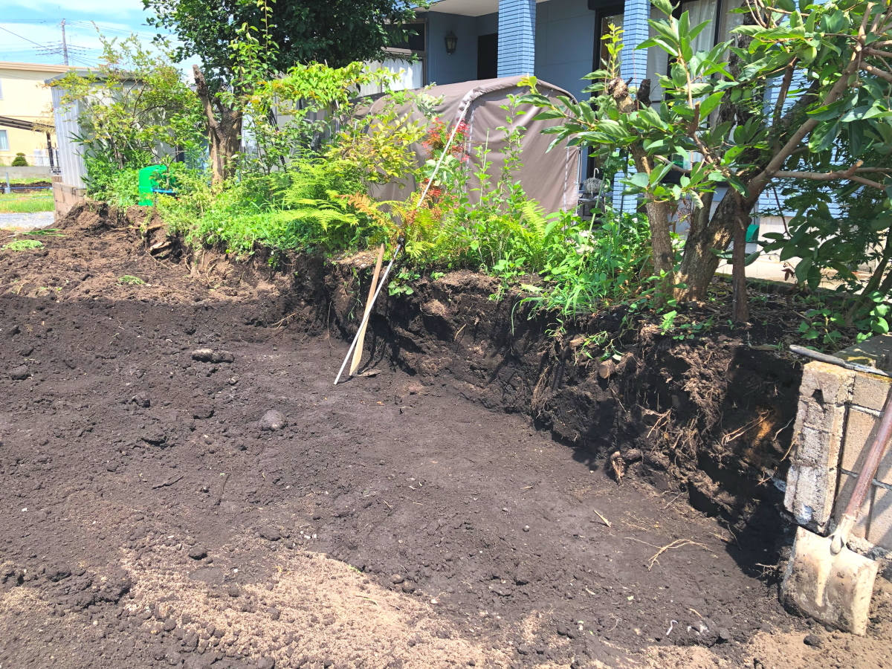
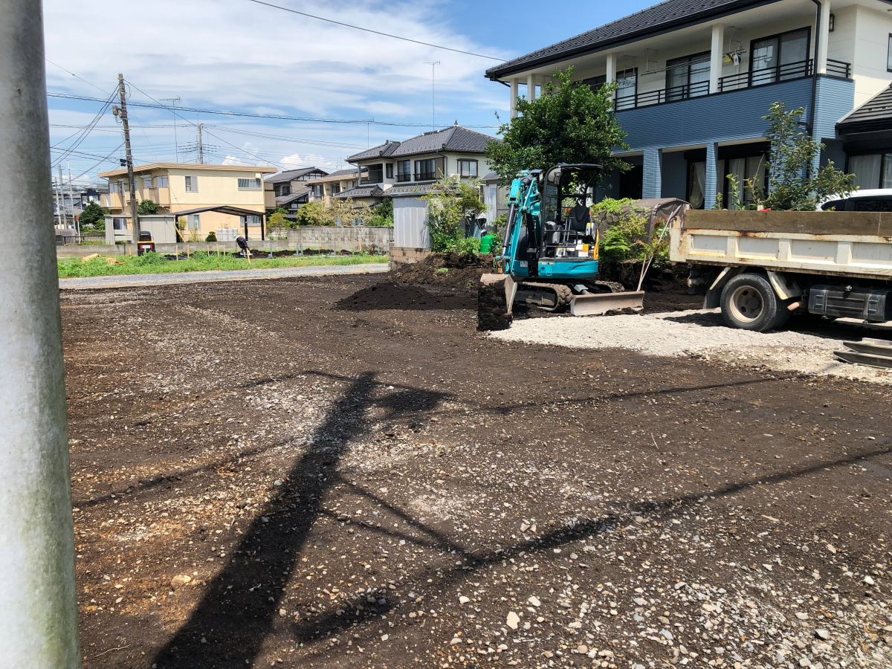
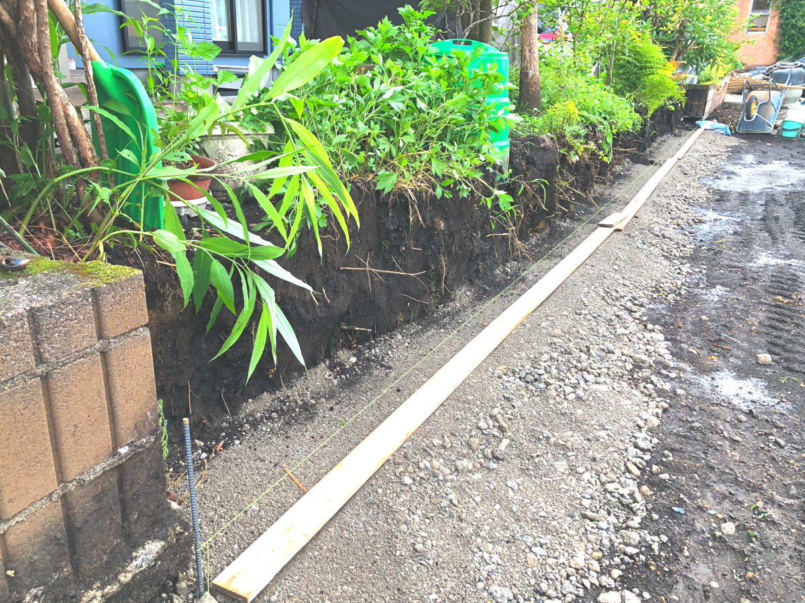

# 2024Jul_tatekae2

<html lang="ja">
 <head>
  <meta charset="utf-8" />
 

<link href="https://cdnjs.cloudflare.com/ajax/libs/lightbox2/2.7.1/css/lightbox.css" rel="stylesheet">
   
</head>
<!--
<body onload="alert('65歳まで、よく頑張りました！　まだまだ元気に〜〜(^o^)/')" onunload="alert('再会の時まで、元気でお過ごしくださいませ〜(^o^)/')">
-->

  モバイル端末をお使いの場合は、画面を横向きにするとより見やすくご覧頂けます。

 &nbsp;お隣の家が建て替え！

<!--
<h2><a href="https://torokoid.github.io/list">クラス会名簿リンク</a></h2>
-->
  

 アクセス用QRコード

<marquee direction="right" scrollamount="20" width="30%">(^_^)/~hada</marquee>

<h2><marquee behavior="left">!!! 2024年7月26日、お隣の家が建て替えになりました !!!</marquee></h2>
<!--

-->

<h3> ～～～7月26日、お隣との境にある花壇の補強工事～～～  </h3>

<h3> ～～～7月26日午後の作業で、花壇が一段引っ込んでブロックのスペースが出来ました～～～  </h3>

<h3> ～～～7月27日、ブロックが積み上がり始めました～～～  </h3>

<h3> ～～～7月20日、4日で基礎も無くなりました～～～  </h3>

<h3> ～～～7月21日、5日でかなりサッパリ～～～  </h3>

<h3> ～～～7月22日、解体作業もほぼ終盤です～～～  </h3>

<h3> ～～～7月23日、花壇を支える大谷石の塀を撤去します 花壇の土が固まってていい具合に残ってますね～～～  </h3>

<h3> ～～～7月23日、午後の作業で花壇の土が崩れないように、土で支えてくれました～～～  </h3>

<h3> ～～～7月24日、レンガとコンクリートが剥がされて、地面だけになりました～～～  </h3>

<h3> ～～～7月25日、午前中でほぼ整地が終わりました～～～  </h3>

<h3> ～～～7月25日、最後に仕上げて、解体作業完了です～～～  </h3>

      

                             

                             
        

  

 

<!-- フッタ -->
 <footer>
 <h3>Copyright 2024/Jul/26 S.Hada</h3>
 </footer>
